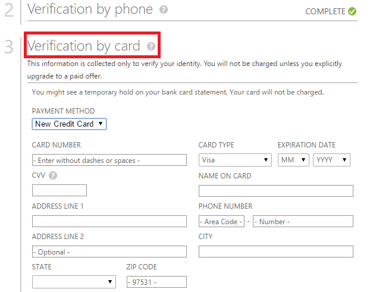
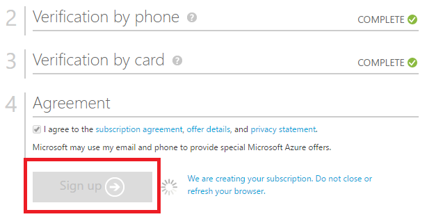
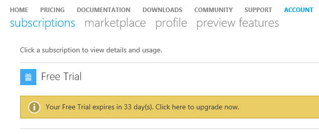
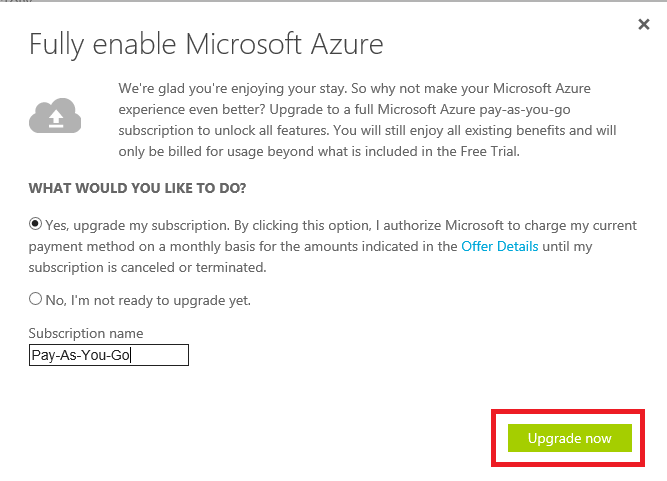

<properties 
	pageTitle="How to buy or sign up for an Azure subscription" 
	description="Describes How to buy or sign up for an Azure subscription" 
	services="billing" 
	documentationCenter="" 
	authors="genli" 
	manager="jarrettr" 
	editor="curtand"/>

<tags 
	ms.service="billing" 
	ms.workload="/" 
	ms.tgt_pltfrm="na" 
	ms.devlang="na" 
	ms.topic="billing" 
	ms.date="08/13/2015" 
	ms.author="genli"/>
# How to buy or sign up for an Azure subscription
## Content:

This topic helps you with the following tasks:

* Sign up for an Azure Free Trial subscription
* Upgrade your Azure Free Trial subscription to a Pay-As-You-Go subscription
* Activate your Azure subscription by using a Service Activation Key (a 5x5 key)

## Sign up for an Azure Free Trial subscription
To sign up for an Azure Free Trial subscription, you must have a phone number, a credit card, and a Microsoft Account (formerly Windows Live ID).  We use the phone number and credit card for identity verification. We want to make sure that real people are using Azure. We do not bill anything to the credit card.  If you would like to pay by invoice, see [Azure Invoicing](http://azure.microsoft.com/en-us/pricing/invoicing/).

1. Open the [Azure free trial page](https://azure.microsoft.com/en-us/pricing/free-trial/), and then click **Try it now**.
2. Sign in to your Microsoft account.
3. In the **About you** section, type your personal information. 
4. In the **Verification by phone** section, select the international dialing code for your country, type your phone number (Do not type the internal dialing code) and then click **Send text message**. You'll soon receive a verification code on your phone. Please use the code to verify your Windows Azure account.  
 
If you do not receive the message, please try the following methods:
 * Use **Call me** option.
 * Use another phone number.
 * Contact [Microsoft Support](http://go.microsoft.com/fwlink/?linkid=544831&clcid=0x409) for help.  
**Note** The VIOP Internet phone number cannot be used for phone verification.
5. After the Phone verification is completed, move to the card
 verification section.

  
6. After the credit card verification is completed, select the **Agreement** option, and then click **Sign Up**. 

 
If you receive the following error message, try to use another browser to complete the sign-up process.  If the issue still occurs, contact [Microsoft Support](http://go.microsoft.com/fwlink/?linkid=544831&clcid=0x409) for help.

7. When the subscription is ready, click **Start managing my service**.

## Upgrade your Azure Free Trial subscription to a Pay-As-You-Go subscription

1. Log on to the [Azure Management portal](https://manage.windowsazure.com/) by using the Microsoft account (formerly Windows Live) that you used to sign up for the free trail.
2. Move to the upper-right corner of the page, and then click **View my bill**. 

3. Select the subscription, and then click **Upgrade**. 
4. Select **Yes**, and then click **Upgrade now**.  

## Activate your Azure subscription by using a Service Activation Key (a 5x5 key)

If you bought Azure in Open credits from a reseller, please follow these steps to activate your subscription:

1. Open the [Azure in Open License key](http://azure.microsoft.com/en-us/pricing/purchase-options/) page, and then select Activate a new subscription or existing subscription.
2. Type the product key, and then check the first agreement option (and also the second option if you want to receive special offers) to activate the subscription. ![./Media/OSAKey.png]
