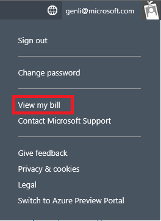
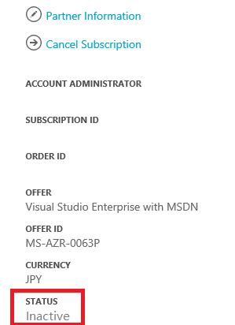

<properties 
	pageTitle="How to cancel your Azure subscription" 
	description="Describes detail steps about How to cancel your Azure subscription" 
	services="billing" 
	documentationCenter="" 
	authors="genli" 
	manager="jarrettr" 
	editor="v-jesits"/>

<tags 
	ms.service="billing" 
	ms.workload="/" 
	ms.tgt_pltfrm="na" 
	ms.devlang="na" 
	ms.topic="billing" 
	ms.date="08/13/2015" 
	ms.author="genli"/>
# How to cancel your Azure subscription
If you cancel this subscription, all of its data will be deleted after the retention period. Make sure you back up the information you want to save before continuing.

1. Log on to the Azure Management Portal by using a subscription administrator account.
2. Move to the upper-right corner of the page, and then click **View my bill**. 

3. Under **Click a subscription to view details and usage**, select the subscription that you want to cancel. 

4. Click **Cancel subscription**.

If the azure subscription is canceled successfully, its status will be displayed as **Inactive**. 

