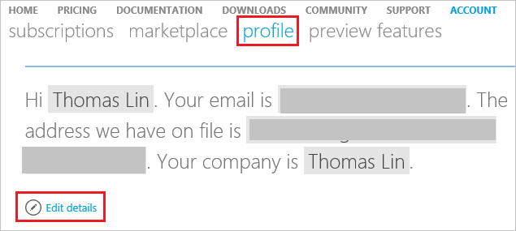

<properties
	pageTitle="How to change profile information of your Azure account| Microsoft Azure"
	description="Describes how to change profile information of your Azure account"
	services="billing"
	documentationCenter=""
	authors="genlin"
	manager="mbaldwin"
	editor=""
	tags="billing"
	/>

<tags
	ms.service="billing"
	ms.workload="na"
	ms.tgt_pltfrm="na"
	ms.devlang="na"
	ms.topic="article"
	ms.date="03/22/2016"
	ms.author="genli"/>

# How to change profile information of your Azure account such as contact email, address and phone number

## Summary

Missed an important email from Azure? Need to update other contact information in your profile? In this article you will find:

-	How to change your profile information
-	Common issues and questions

Important information about changing your profile email address:

The email address in your profile is used by Microsoft to communicate with you. Changing the Account Administrator’s email address might cause you to miss some email because you might not get all email notifications in the same place. Therefore, we recommend that the email address in the user profile be the same as that for the Account Administrator so that you receive all communications associated with the subscription.

## How to change your profile information

1.	Sign in to the [Azure Account Center](https://account.windowsazure.com/) as the Account Administrator and click **Profile**, or simply go to https://account.windowsazure.com/Profile.

2.	Select the **Edit details** button, and then update the **Profile** information.

	

## Frequently Asked Questions

### Can I change the Account Administrator email address in my profile?

Yes. Note: The Account Administrator is the person who set up the Azure account and receives e-mail notifications for the account. Using a different email account in your profile might cause you to miss some email. See Important information about changing your profile email address above in this article.

### Does updating my profile email also update my login email address?

No. Updating the profile email address will not update your login email address. You will still need to log in with this address. In order to change your login email address, you will need to transfer ownership of the account.

### Does updating my profile address also update my credit card billing address?
No, this does not update the billing address associated with your credit card. You can update the billing address associated with your credit card by going to the subscription page in the Azure Account Center. To change the billing address, select the subscription and click Change subscription address on the right side of the page.

### Why can’t I update the country?

Due to technical constraints, we’re unable to change the country on an existing account. However, you can create a new account in the desired country and contact Azure support to migrate your services over.

### What email address does the Azure Billing Alerts preview feature use?

If you sign up for the new Azure Billing Alerts preview feature, you will get Azure Billing Alerts email at the address you specify, whether or not you have changed the Account Administrator email address.
