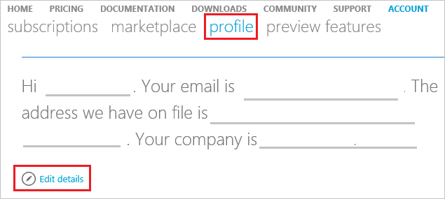

<properties
	pageTitle="How to change profile information of your Azure account| Microsoft Azure"
	description="Describes how to change profile information of your Azure account"
	services="billing"
	documentationCenter=""
	authors="genlin"
	manager="mbaldwin"
	editor=""
	tags="billing"
	/>

<tags
	ms.service="billing"
	ms.workload="na"
	ms.tgt_pltfrm="na"
	ms.devlang="na"
	ms.topic="article"
	ms.date="03/22/2016"
	ms.author="genli"/>

# How to change profile information of your Azure account such as contact email, address and phone number

## Summary

Missed an important email from Azure? Want to update other contact information in your profile? In this article you will find:

-	[How to change your profile information](#how-to-change-your-profile-information)
-	[Answers to common issues and questions](#frequently-asked-questions)

Important information about changing your profile email address:

The email address in your profile is used by Microsoft to communicate with you. If you change the Account Administrator’s email profile address, you might miss some email because you may not receive all email notifications in the same place. Therefore, to make sure that you receive all communications associated with the subscription, we recommend that the email address in the user profile be the same as the email address for the Account Administrator.

## How to change your profile information

1.	Sign in to the [Azure Account Center](https://account.windowsazure.com/) as the account administrator and then click **Profile**. Or just go to https://account.windowsazure.com/Profile.

2.	Select the **Edit details** button, and then update the **Profile** information.

	

## Frequently asked questions

### Can I change the Account Administrator email address in my profile?

Yes. The Account Administrator is the person who set up the Azure account and who receives e-mail notifications for the account. Using a different email account in your profile might cause you to miss some email. See Important information about changing your profile email address earlier in this article.

### Does updating my profile email also update my login email address?

No. Updating the profile email address does not update your login email address. You must still log in with this address. To change your login email address, you have to transfer ownership of the account.

### Does updating my profile address also update my credit card billing address?

No. You can update the billing address associated with your credit card by going to the subscription page in the Azure Account Center. To change the billing address, select the subscription and then click **Change subscription address** on the right side of the page.

### Why can’t I update the country?

Because of technical constraints, we cannot to change the country on an existing account. However, you can create a new account in the desired country and then contact Azure support to migrate your services to that account.

### What email address does the Azure Billing Alerts preview feature use?

If you sign up for the new Azure Billing Alerts preview feature, you will receive Azure Billing Alerts email at the address you specify, regardless of whether you have changed the Account Administrator email address.
