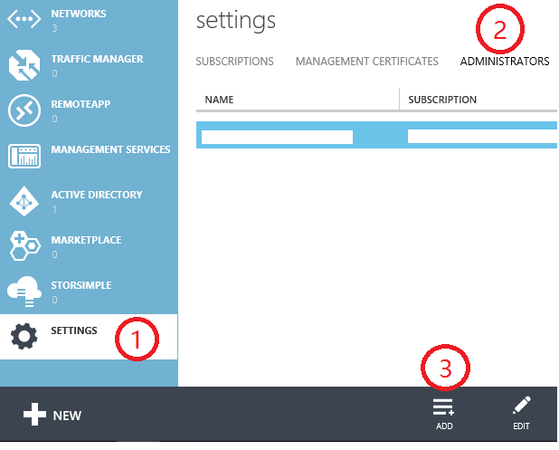
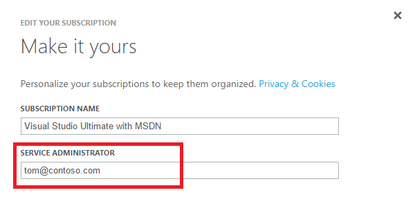

# How to add or change Azure C-Administrator, Service Administrator and Account Administrator

## Summary
This topic help you with the following task:

* Understand the different between the three administrator roles
* Add a Co-Administrator for an subscription
* Change Service Administrator for a subscription
* Change the Account Administrator (transfer ownership of the Azure account to another account)

## Azure administrators

There are three kinds of administrator roles in Windows azure:

| Administrative role   | Limit  | Description
| ------------- | ------------- |---------------|
|Account Administrator  | 1 per Azure account  |It is the account you used to sign up or buy azure subscriptions. It is Authorized to access the Account Center (create subscriptions, cancel subscriptions, change billing for a subscription, change Service Administrator, and more)
| Service Administrator | 1 per Azure subscription  |Authorized to access Azure Management Portal for all subscriptions in the account. By default, same as the Account Administrator when a subscription is created|
|Co-administrator|200 per subscription (in addition to Service Administrator)|Same as Service Administrator, but can’t change the association of subscriptions to Azure directories.|

## Add a Co-Administrator for a subscription
1. Sign in to the [Azure Management Portal](https://manage.windowsazure.com/).
2. In the navigation pane, click **Settings**, click **Administrators**, and then click **Add**.  
3. Type the user’s email address, and then select the check mark for the subscription that you want the user to access.   

**Note**
 * If you are logged in with a Microsoft Account, you can only add other Microsoft Accounts as Service Administrator or Co-Administrator. This is a security consideration to prevent non-organizational accounts from discovering if certain accounts (e.g. janedoe@contoso.com) are valid accounts.
 * If you are logged in with an organizational account, you can add other organizational accounts in your organization as Service Administrator or Co-Administrator. For example, abby@contoso.com can add bob@contoso.com as Service Administrator or Co-Administrator, but cannot add john@notcontoso.com. Users logged in with organizational accounts can continue to add Microsoft Account users as Service Administrator or Co-Administrator.

## Change Service Administrator for a subscription
To change the service  account for a subscription, you need the Account Administrator privilege.

1. Log on into [Account Management Portal](https://account.windowsazure.com/subscriptions) by using the Account Administrator.
2. Click the Subscription which you want to change its service administrator  account.
3. On the right side, click **Edit subscription** details.  

4. In the **Service administrator** box, enter the email address of the new service administrator. 

## Change the Account Administrator (transfer ownership of the Azure account to another account)

To transfer ownership of the Azure account to another. Account, see [Transferring an Azure subscription](https://azure.microsoft.com/en-us/documentation/articles/billing-subscription-transfer/)
