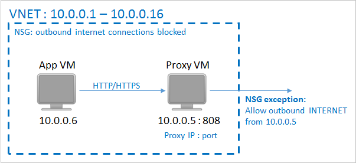
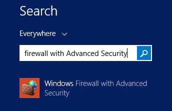
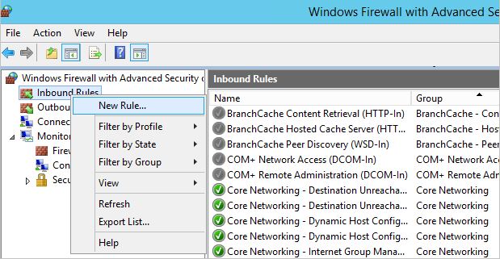
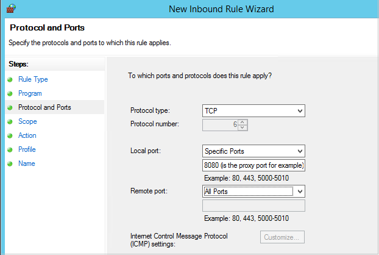

<properties
	pageTitle="Azure VM Backup fails with "Could not communicate with the VM agent for snapshot status. Snapshot VM sub task timed out" error message | Microsoft Azure"
	description=""
	services="storage"
	documentationCenter=""
	authors="genlin"
	manager="felixwu"
	editor=""/>

<tags
	ms.service="storage"
	ms.workload="storage"
	ms.tgt_pltfrm="na"
	ms.devlang="dotnet"
	ms.topic="article"
	ms.date="04/07/2016"
	ms.author="genli"/>

# "Could not communicate with the VM agent for snapshot status. Snapshot VM sub task timed out" error message when Azure VM Backup fails

# Summary

This article helps resolve the issue that you receive the following error when you try to backup Azure VM in the Backup vault:

**Could not communicate with the VM agent for snapshot status. Snapshot VM sub task timed out.**

The issue can be caused by the following circumstances:

- The VM does not have Internet Access.

	The backup extension requires connectivity to the Azure public IP addresses to function correctly. This is because it sends commands to an Azure Storage endpoint (HTTP URL) to manage the snapshots of the VM. If the extension does not have access to the public Internet,  the backup eventually fails.
- The "Windows Azure VM agent" installed in the VM is out of date.
- The "Backup extension" fails to update or load.
- The snapshots status cannot be retrieved or the snapshots cannot be taken.

[AZURE.INCLUDE [support-disclaimer](../../includes/support-disclaimer.md)]

## Resolution

### Issue 1: The VM has no Internet access

Per the deployment requirement, the VM might has no Internet access, or has restrictions in place that prevent access to the Azure infrastructure. In this scenario, use one of the following methods to resolve the issue:

**Method A：Whitelist the Azure datacenter IP ranges**

1.	Obtain the [list of Azure datacenter IPs](https://www.microsoft.com/download/details.aspx?id=41653) to be whitelisted.
2.	Unblock the IPs by using the **New-NetRoute** cmdlet. Run this cmdlet in the Azure VM in an elevated PowerShell window (run as Administrator).
3.	Add rules to the Network Security Group (NSG) if you have one to allow access to the IPs.

**Method B: Create a path for HTTP traffic to flow**

1.	If you have some network restriction in place (for example, an NSG), deploy an HTTP proxy server to route the traffic.
2.	If you have an NSG, add rules to allow access to the Internet from the HTTP proxy.

> [AZURE.NOTE] DHCP must be enabled inside the guest for an IaaS VM backup to work.  If the VM cannot get a host or fabric address from DHCP response 245, it cannot download or run any extensions. If you need a static private IP, you should configure it through the platform. The DHCP option inside the VM should be left enabled. For more information, see [How to Set a Static Internal Private IP](virtual-networks-reserved-private-ip.md).

#### How to set up an HTTP proxy for VM backups

There is no recommendation for the proxy software that you should use. Make sure that you pick a proxy software that is compatible with the following configuration steps.

In the following example, the App VM is configured to use the Proxy VM for all HTTP traffic bound for the public Internet. The Proxy VM is configured to allow incoming traffic from VMs in the virtual network. And finally, the NSG (named NSG-lockdown) requires a new security rule that allows outbound Internet traffic from the Proxy VM.

**Step 1: Allow outgoing network connections**

Set up a computer-wide proxy configuration for any outgoing HTTP/HTTPS traffic.

For Windows-based computers, run the following command at an elevated command prompt:

	netsh winhttp set proxy http://<Proxy IP>:<proxy port>

For Linux-based computers, add the following line to the /etc/environment file:

	http_proxy=http://<Proxy IP>:<proxy port>

Then, add the following lines to the /etc/waagent.conf file:

	HttpProxy.Host=<proxy IP>
	HttpProxy.Port=<proxy port>

**Step 2: Allow incoming connections on the proxy server**

1.	On the proxy server, open Windows Firewall. The easiest way to access the firewall is to search on Windows Firewall with Advanced Security.
	
	

2.	In the Windows Firewall dialog box, right-click Inbound Rules, and then click New Rule.
3.	
	

3.	In the New Inbound Rule Wizard, select the Custom option for the Rule Type, and then click Next.
4.	On the page to select the Program, select All Programs, and then click Next.
5.	On the Protocol and Ports page, specify the following information, and then click Next.

	
	- For Protocol type, select TCP.
	- For Local port, select Specific Ports.
	- In the second Local port field,  specify the <Proxy Port> that has been configured.
  - For Remote port, select All Ports.

For the rest of the wizard, click all the way to the end, and then give this rule a name.

**Step 3: Add an exception rule to the NSG**

At an Azure PowerShell command prompt, enter the following command:

	Get-AzureNetworkSecurityGroup -Name "NSG-lockdown" |Set-AzureNetworkSecurityRule -Name "allow-proxy " -Action Allow -Protocol TCP -Type Outbound -Priority 200 -SourceAddressPrefix "10.0.0.5/32" -SourcePortRange "*" -DestinationAddressPrefix Internet -DestinationPortRange "80-443"

>[AZURE.NOTE] In this example, replace the names by using the details that are appropriate to your deployment.
This command adds an exception to the NSG that allows TCP traffic from any port on 10.0.0.5 to access any Internet address on port 80 (HTTP) or 443 (HTTPS). If you have to reach a specific port in the public Internet, make sure that you also add that port to the -DestinationPortRange setting.

### Issue 2 Windows Azure VM agent is out of date (For Linux VMs)

Most agent-related or extension-related failures for Linux VMs are caused by issues that affect an old VM agent. As a general guideline, the first steps to troubleshoot this issue are the following:

1.  [Install the latest Azure VM agent](https://acom-swtest-2.azurewebsites.net/documentation/articles/virtual-machines-linux-update-agent/).
2.  Make sure that the Azure agent is running on the VM. To do this, run the following command:

		ps -e

 If this process is not running, use the following commands to restart it.

 For Ubuntu:

		service walinuxagent start

 For other distributions:

		service waagent start
3. Configure the auto restart agent.

Run a new test backup. If the failures persist, please collect logs from the following folders for further debugging.

We require the following logs from the customer’s VM:

/var/lib/waagent/*.xml

/var/log/waagent.log

/var/log/azure/*

If we require verbose logging for waagent, follow these steps to enable this:

1. In the /etc/waagent.conf file, locate the following line:

	Enable verbose logging (y|n)

2. Change the Logs.Verbose value from n to  y.

3. Save the change, and then restart waagent by following the previous steps in this section.

### Issue 3 The backup extension cannot be loaded

If extensions cannot be loaded, then Backup fails because a snapshot cannot be taken.

For Windows guests, verify that the iaasvmprovider service is enabled and has a startup type of automatic. If this is not the configuration, enable the service to determine whether the next backup succeeds.

You can force the VMSnapshot extension to be reloaded by installing the extension. The next backup attempt will reload the extension.

To uninstall the extension, go to https://ms.portal.azure.com/, locate the particular VM that has backup problems, click Settings, click Extensions, click Vmsnapshot Extension, and then click uninstall.

This will cause the extension to be reinstalled during the next backup.

### Issue 4 The snapshots status cannot be retrieved or the snapshots cannot be taken

VM Backup relies on issuing snapshot command to underlying storage. The back can fail because it has no access to storage or because of a delay in snapshot task execution. The following conditions can cause snapshot task failure:

-	VMs that have Microsoft SQL Server Backup configured. By default, VM Backup runs a VSS Full backup on Windows VMs. On VMs that are running SQL Server-based servers and on which SQL Server Backup is configured, snapshot execution delays may occur. Set following registry key if you are experiencing backup failures because of snapshot issues.

 [HKEY_LOCAL_MACHINE\SOFTWARE\MICROSOFT\BCDRAGENT]
 "USEVSSCOPYBACKUP"="TRUE"

- VM status is reported incorrectly because the VM is shut down in RDP. If you shut down the virtual machine in RDP, check the portal to determine whether that VM status is reflected correctly. If it’s not, shut down the VM in the portal by using the ”Shutdown” option in the VM dashboard.

-	Many VMs from the same cloud service are configured to back up at the same time. It’s a best practice to spread out the VMs from the same cloud service to have different backup schedules.

-	The VM is running at high CPU  or memory usage. If the VM is running at high CPU usage (more than 90 percent) or high memory usage, the snapshot task is queued and delayed and eventually times out. In this situation, try on-demand backup.
